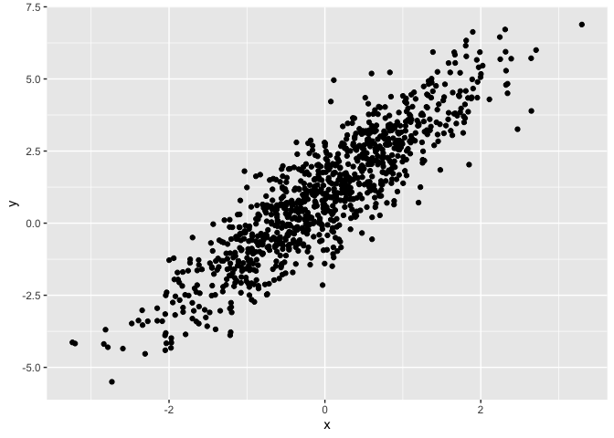
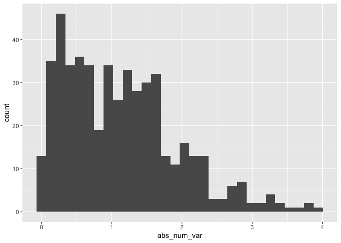

Simple document
================

``` r
library(tidyverse)
```

I’m an R Markdown document!

# Section 1

Here’s a **code chunk** that samples from a *normal distribution*:

``` r
samp = rnorm(100)
length(samp)
```

    ## [1] 100

# Section 2

I can take the mean of the sample, too! The mean is -0.0622992. -0.06
\#this will round to 2 decimal places

# Section 3

## Plot from last time

This is going to make a plot! First I generate a dataframe, then use
`ggplot` to make a scatterplot. (Option command i to make code chunk)

<!-- -->

### Plot for learning assessment

``` r
assessment_df=
  tibble(
    num_var=rnorm(n=500, mean=1),
    num_var_pos=num_var >0,
    abs_num_var=abs(num_var)
  )
ggplot(assessment_df,aes(x=abs_num_var)) + geom_histogram()
```

    ## `stat_bin()` using `bins = 30`. Pick better value with `binwidth`.

<!-- -->

Here’s a list: \* List item 1 \* List item 2
